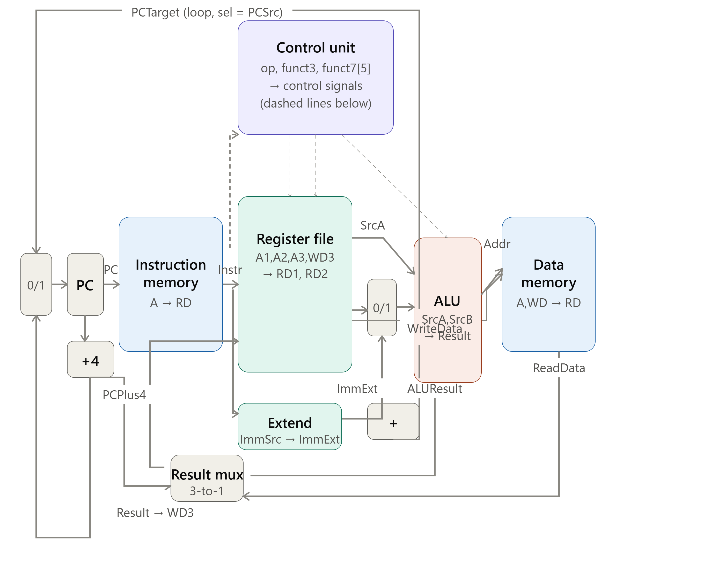

# Single-Cycle RISC-V Processor (RV32I subset + custom MUL)

A single-cycle RISC-V processor implemented in SystemVerilog, following the classic datapath from Sarah & David Harris's *Digital Design and Computer Architecture: RISC-V Edition*, extended with a **custom multiply instruction**. Built as the foundation stage of a Final Year Project that will evolve this design into a **5-stage pipelined** processor.



---

## Table of Contents
- [Overview](#overview)
- [Architecture](#architecture)
- [Module Breakdown](#module-breakdown)
- [Control Logic](#control-logic)
- [Supported Instructions](#supported-instructions)
- [Custom MUL Extension](#custom-mul-extension)
- [Repository Structure](#repository-structure)
- [Building & Running](#building--running)
- [Verification](#verification)
- [Roadmap: 5-Stage Pipeline](#roadmap-5-stage-pipeline)
- [References](#references)

---

## Overview

Every instruction in this design fetches, decodes, executes, accesses memory, and writes back **within a single clock edge** — there is no instruction overlap and therefore no pipeline hazards to resolve. The tradeoff is that the clock period must be long enough to accommodate the slowest instruction's full path through the datapath (typically `lw`, which touches instruction memory, register file, ALU, and data memory in one cycle).

This project targets a **limited RV32I subset** (see [Supported Instructions](#supported-instructions)) plus one non-standard addition: a combinational `mul` operation added to the ALU.

---

## Architecture

The datapath (see diagram above) follows the standard Harris & Harris structure:

- **PC register (`flopr`)** — updated every clock edge to `PCPlus4` or `PCTarget` depending on `PCSrc`
- **Instruction memory (`imem`)** — combinational, byte-addressed via `PC[31:2]`, loaded from `imem.hex` with `$readmemh`
- **Register file (`regfile`)** — 32 × 32-bit, two combinational read ports, one clocked write port, `x0` hardwired to zero
- **Immediate extender (`extend`)** — produces sign-extended immediates for I, S, B, and J formats
- **ALU (`alu`)** — add, subtract, and, or, slt, and custom mul
- **Data memory (`dmem`)** — word-addressed, synchronous write / combinational read
- **Result mux (`mux3`)** — selects `ALUResult`, `ReadData`, or `PCPlus4` as the value written back to the register file

Two adders compute `PC + 4` and `PC + ImmExt` (branch/jump target) in parallel every cycle; a mux selects between them based on `PCSrc`.

---

## Module Breakdown

| File | Role |
|---|---|
| `top.v` | Test harness — wires `riscvsingle` to `imem` and `dmem` |
| `riscvsingle.v` | Top-level CPU — instantiates `controller` and `datapath` |
| `datapath.v` | PC logic, register file, immediate extend, ALU, result mux |
| `controller.v` | Combines `maindec` and `aludec`; computes `PCSrc = (Branch & Zero) \| Jump` |
| `maindec.v` | Main decoder — opcode → coarse control signals |
| `aludec.v` | ALU decoder — `funct3`/`funct7`/`ALUOp` → 3-bit `ALUControl` |
| `alu.v` | Executes add / sub / and / or / slt / mul |
| `regfile.v` | 32×32-bit register file |
| `extend.v` | I/S/B/J immediate sign-extension |
| `imem.v` | Instruction memory, loads `imem.hex` |
| `dmem.v` | Data memory |
| `flopr.v`, `adder.v`, `mux2.v`, `mux3.v` | Generic reusable building blocks |
| `testbench.v` | Self-checking testbench for the base instruction program |
| `testbench_addmul.v` | Waveform-dump testbench for the `mul`-exercising program |
| `imem.hex` | Assembled machine code for the base test program |
| `addmul.elf` / `addmul.vcd` | Compiled binary and waveform dump for the mul test |

---

## Control Logic

### Main decoder (`maindec.v`)

`{RegWrite, ImmSrc[1:0], ALUSrc, MemWrite, ResultSrc[1:0], Branch, ALUOp[1:0], Jump}`

| Instruction | opcode | Encoding |
|---|---|---|
| `lw` | `0000011` | `1_00_1_0_01_0_00_0` |
| `sw` | `0100011` | `0_01_1_1_00_0_00_0` |
| R-type | `0110011` | `1_00_0_0_00_0_10_0` |
| `beq` | `1100011` | `0_10_0_0_00_1_01_0` |
| `addi` | `0010011` | `1_00_1_0_00_0_10_0` |
| `jal` | `1101111` | `1_11_0_0_10_0_00_1` |

### ALU decoder (`aludec.v`)

| ALUOp | Condition | ALUControl | Operation |
|---|---|---|---|
| `00` | — | `000` | add (`lw`/`sw`/`addi` address calc) |
| `01` | — | `001` | subtract (`beq` comparison) |
| `10` | `funct3=000`, `funct7=0000001` | `100` | **mul** (custom) |
| `10` | `funct3=000`, `funct7=0100000` | `001` | sub |
| `10` | `funct3=000`, else | `000` | add |
| `10` | `funct3=010` | `101` | slt |
| `10` | `funct3=110` | `011` | or |
| `10` | `funct3=111` | `010` | and |

---

## Supported Instructions

| Type | Instructions |
|---|---|
| R-type | `add`, `sub`, `and`, `or`, `slt`, `mul` (custom) |
| I-type | `addi`, `lw` |
| S-type | `sw` |
| B-type | `beq` |
| J-type | `jal` |

This is intentionally a **limited subset** — not all of RV32I is implemented (e.g. no `xor`, `sll`, `srl`, `sra`, `sltu`, `bne`/`blt`/`bge`, `lui`/`auipc`, `jalr`). Any compiled C program must be checked with `objdump -d` before use, since unsupported instructions will silently produce incorrect results rather than an error.

---

## Custom MUL Extension

The base Harris & Harris single-cycle design does not include multiply. This project adds it by:

- Reusing the R-type opcode (`0110011`) with `funct3 = 000` and `funct7 = 0000001` (the encoding RV32M reserves for `mul`) to select a new `ALUControl = 100`.
- Implementing `a * b` directly and combinationally inside `alu.v` alongside the existing add/sub/logic operations.

This is **not** a standard RV32M implementation — a real multiplier is usually multi-cycle or pipelined internally due to its critical path. Here it's done combinationally in one cycle, which is acceptable for a single-cycle design at simulation clock speeds but would become the new critical path (and likely need its own pipeline stage or multi-cycle handling) once this design moves to a pipelined implementation.

The `mul` datapath is exercised separately via `testbench_addmul.v`, which dumps a waveform (`addmul.vcd`) instead of doing register-level self-checking.

---

## Repository Structure

```
.
├── adder.v
├── alu.v
├── aludec.v
├── controller.v
├── datapath.v
├── dmem.v
├── extend.v
├── flopr.v
├── imem.v
├── imem.hex
├── maindec.v
├── mux2.v
├── mux3.v
├── regfile.v
├── riscvsingle.v
├── top.v
├── testbench.v
├── testbench_addmul.v
├── addmul.elf
├── addmul.vcd
├── run_addmul.ps1
├── triscv_single_cycle_full_datapatzh.png
└── README.md
```

---

## Building & Running

Requires [Icarus Verilog](http://iverilog.icarus.com/) (`iverilog` / `vvp`) — SystemVerilog constructs (`logic`, `always_comb`, `always_ff`) require the `-g2005-sv` flag.

### Base self-checking test

```bash
iverilog -g2005-sv -o simv adder.v alu.v aludec.v controller.v datapath.v dmem.v \
    extend.v flopr.v imem.v maindec.v mux2.v mux3.v regfile.v riscvsingle.v top.v testbench.v
vvp simv
```

### MUL / waveform test (Windows PowerShell)

```powershell
./run_addmul.ps1
```

This compiles the same core against `testbench_addmul.v`, runs 200 clock cycles, and produces `addmul.vcd` for inspection in GTKWave. On Linux/macOS the equivalent is:

```bash
iverilog -g2005-sv -o simv adder.v alu.v aludec.v controller.v datapath.v dmem.v \
    extend.v flopr.v imem.v maindec.v mux2.v mux3.v regfile.v riscvsingle.v top.v testbench_addmul.v
vvp simv
gtkwave addmul.vcd
```

---

## Verification

`testbench.v` is self-checking:

- Runs the program in `imem.hex`, which exercises `addi`, `add`, `sub`, `and`, `or`, `slt`, `beq` (both taken and not-taken), `sw`, `lw`, and `jal`.
- The program halts by branching to itself (`beq x0, x0, 0`); the testbench detects this by watching for the PC to stop changing for 3 consecutive cycles.
- On every store, it checks that the write to address `96` equals `6` (the expected result of the computation).
- At halt, it checks the final register file state against expected values:

  | Register | Expected |
  |---|---|
  | `x2` | 23 |
  | `x3` | 12 |
  | `x4` | 0 |
  | `x5` | 11 |
  | `x6` | 2 |
  | `x7` | 6 |
  | `x9` | 17 |

- A 2000-time-unit timeout guards against the simulation hanging if the halt loop is never reached.

`testbench_addmul.v` instead runs a fixed 200 cycles and dumps a full waveform (`addmul.vcd`) for manually inspecting the `mul` datapath in GTKWave, rather than doing an automated pass/fail check.

---

## Roadmap: 5-Stage Pipeline

The next phase of this FYP is converting this single-cycle core into a **5-stage pipelined** processor (Fetch → Decode → Execute → Memory → Writeback). This is **planned, not yet implemented** in this repository. It will require:

1. **Pipeline registers** (`IF/ID`, `ID/EX`, `EX/MEM`, `MEM/WB`) to carry instruction data and control signals between stages, so multiple instructions are in flight simultaneously.
2. **Hazard detection** for RAW data hazards, and specifically the **load-use hazard** (a `lw` followed immediately by an instruction that uses its result), which needs a stall since the loaded value isn't ready until MEM.
3. **Forwarding/bypass paths** from `EX/MEM` and `MEM/WB` back into the EX stage ALU inputs, to resolve most data hazards without stalling.
4. **Control hazard handling** for `beq`/`jal` — since branch outcomes resolve later than fetch, incorrectly fetched instructions must be flushed from the earlier pipeline stages.
5. **Re-timing the custom `mul` operation** — a combinational multiply that fits in a single cycle today will likely become the critical path once each pipeline stage has a much shorter clock period, and may need to become a multi-cycle or dedicated-stage operation.
6. Re-verification against the same architectural test program, now checked for correctness across overlapping instructions rather than sequential single-cycle execution.

---

## References

- Sarah L. Harris & David Money Harris, *Digital Design and Computer Architecture: RISC-V Edition*
- [RISC-V ISA Specifications](https://riscv.org/technical/specifications/)
